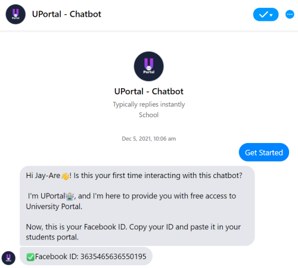
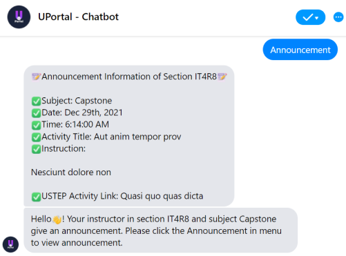
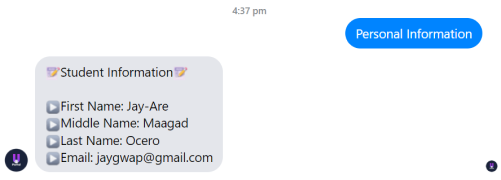

<!-- PROJECT LOGO -->
<br />
<div align="center">
    

<h3 align="center">UPortal</h3>

  <p align="center">
    Hussle free access to university portal.
  </p>
</div>

<!-- ABOUT THE PROJECT -->
## About The Project

<summary>Get Started</summary>
<div align="center">
  
  
  
</div>
UPortal is a free access to university portal. The students that don't have enough money to buy load can use this chatbot to check announcements from UPortal(school portal) and profile information. 

<p align="right">(<a href="#top">back to top</a>)</p>


### Built With

* [Node.js](https://nodejs.org)


<p align="right">(<a href="#top">back to top</a>)</p>


<!-- GETTING STARTED -->
## Getting Started

This is the instructions on setting up the project locally. To get a local copy up and running follow these simple example steps.

### Installation

1. Clone the repo
   ```sh
   git clone https://github.com/199ocero/uportal-chatbot-node-js.git
   ```
2. Create account in Heroku
4. Create new app
5. Download and install Heroku CLI
6. Open the project folder you have cloned
7. Login to your heroku account using CLI in vscode terminal
8. Upload source code to created app in Heroku
   ```sh
   git init
   git add .
   git commit -m "My first commit"
   git push heroku master
   ```

<p align="right">(<a href="#top">back to top</a>)</p>


<!-- USAGE EXAMPLES -->
<!-- ## Usage -->

<!-- Use this space to show useful examples of how a project can be used. Additional screenshots, code examples and demos work well in this space. You may also link to more resources. -->

<!-- _For more examples, please refer to the [Documentation](https://example.com)_ -->

<!-- <p align="right">(<a href="#top">back to top</a>)</p> -->


<!-- ROADMAP -->
<!-- ## Roadmap -->

<!-- - [] Feature 1
- [] Feature 2
- [] Feature 3
    - [] Nested Feature

See the [open issues](https://github.com/github_username/repo_name/issues) for a full list of proposed features (and known issues).

<p align="right">(<a href="#top">back to top</a>)</p> -->


<!-- CONTRIBUTING -->
<!-- ## Contributing -->

<!-- Contributions are what make the open source community such an amazing place to learn, inspire, and create. Any contributions you make are **greatly appreciated**.

If you have a suggestion that would make this better, please fork the repo and create a pull request. You can also simply open an issue with the tag "enhancement".
Don't forget to give the project a star! Thanks again!

1. Fork the Project
2. Create your Feature Branch (`git checkout -b feature/AmazingFeature`)
3. Commit your Changes (`git commit -m 'Add some AmazingFeature'`)
4. Push to the Branch (`git push origin feature/AmazingFeature`)
5. Open a Pull Request

<p align="right">(<a href="#top">back to top</a>)</p> -->


<!-- LICENSE -->
<!-- ## License -->

<!-- Distributed under the MIT License. See `LICENSE.txt` for more information.

<p align="right">(<a href="#top">back to top</a>)</p> -->


<!-- CONTACT -->
## Contact

Developer: Jay-Are Ocero - 199ocero@gmail.com
<br>
Project Manager: Shanon Jamlan - shan.jamlan1@gmail.com
<br>
Tester: Jay-Ann Arquiza - jayannarquiza0824@gmail.com
<br>
Tester: Ryza Sapitanan - iamryzamae@gmail.com

<p align="right">(<a href="#top">back to top</a>)</p>


<!-- ACKNOWLEDGMENTS -->
## Acknowledgments

<p align="justify"><strong>Engr. Al-monte Vince M. Calo</strong> - Department Chair of the College of Information Technology and Computing of the University of Science and Technology of Southern Philippines - Cagayan de Oro City Campus, for giving us the opportunity to pursue this study and in providing us invaluable guidance throughout this capstone project journey. It was a real honor and privilege to work under his direction. We are appreciative for what he has done for us.</p>
<br>
<p align="justify"><strong>Thesis Panels</strong> - We owe a deep sense of gratitude also to our thesis panelists who provided constructive feedback as well as suggestions and recommendations to help us better our research.</p>
<br>

<p align="justify"><strong>Parents</strong> - To our parents who never failed to give us their all in support and guidance with our everyday endeavors.</p>
<br>

Without these people, it wouldn’t be possible for us to finish this paper and accomplish what we aspire to achieve. Thank you so much!


<p align="right">(<a href="#top">back to top</a>)</p>


<!-- MARKDOWN LINKS & IMAGES -->
<!-- https://www.markdownguide.org/basic-syntax/#reference-style-links -->
[contributors-shield]: https://img.shields.io/github/contributors/github_username/repo_name.svg?style=for-the-badge
[contributors-url]: https://github.com/github_username/repo_name/graphs/contributors
[forks-shield]: https://img.shields.io/github/forks/github_username/repo_name.svg?style=for-the-badge
[forks-url]: https://github.com/github_username/repo_name/network/members
[stars-shield]: https://img.shields.io/github/stars/github_username/repo_name.svg?style=for-the-badge
[stars-url]: https://github.com/github_username/repo_name/stargazers
[issues-shield]: https://img.shields.io/github/issues/github_username/repo_name.svg?style=for-the-badge
[issues-url]: https://github.com/github_username/repo_name/issues
[license-shield]: https://img.shields.io/github/license/github_username/repo_name.svg?style=for-the-badge
[license-url]: https://github.com/github_username/repo_name/blob/master/LICENSE.txt
[linkedin-shield]: https://img.shields.io/badge/-LinkedIn-black.svg?style=for-the-badge&logo=linkedin&colorB=555
[linkedin-url]: https://linkedin.com/in/linkedin_username
[product-screenshot]: images/screenshot.png
